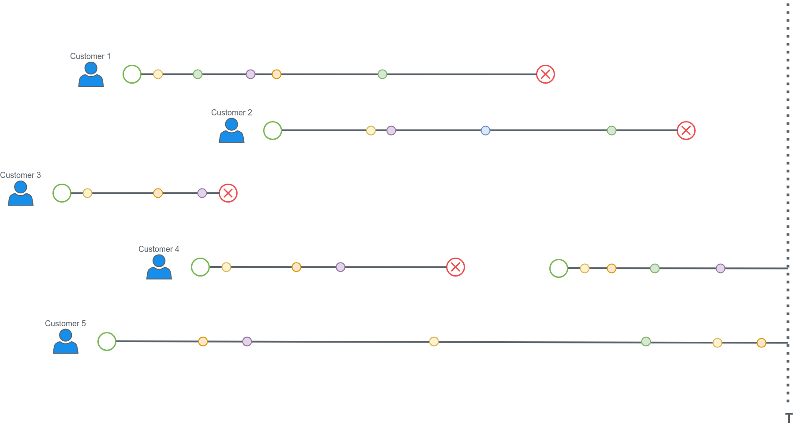
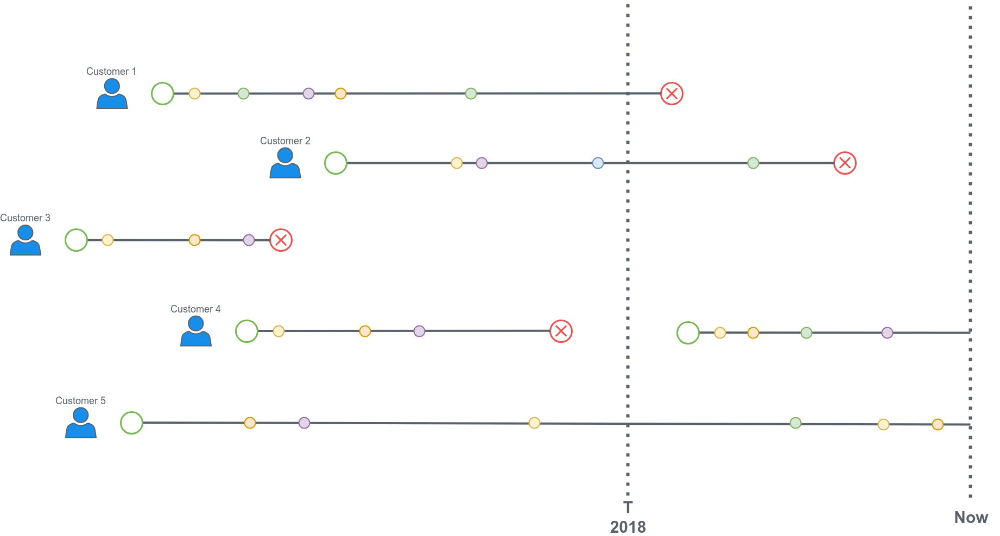

_This article was originally published on the [Buffer Blog](https://buffer.com/resources/predicting-churn/) and later republished on [Medium](https://medium.com/@davidgasquez/churn-prediction-first-contact-aa35292f168d)._

There’s a lot written about **churn**. A quick google search returns several blog posts with various definitions and types of churn. That said, not a lot of what’s written is in form of code. At least not open source code. Since the definition of churn depends on the domain and company, a few companies share how they predict churn.

At [Buffer](https://buffer.com/), we decided to spend a few weeks trying to predict when our customers are going to stop paying for a specific subscription. We called that **subscription churn**.

As a starting point, we used a lean approach aiming to get something working end to end quickly. Personally, I underestimated how different this problem was from other Machine Learning problems I’m used to. Churn prediction differs in a few things from a classical Machine Learning problem.

The goal of this post is to summarize some personal learnings when dealing with Churn Prediction for the first time.

## Framing the Problem

The first and one of the most important step in any Machine Learning problem is defining what you want to get from the model (_model output_). Taking a business objective and translating it to a Machine Learning problem is not always so easy and requires practice. If you haven’t worked with this problem before you might encounter a few new interesting things.

Let’s start with what we know. We have a few years of historical data and lots of examples of customers that churned. We know what they did (_events_), and when they stopped paying for the service (_churn_).

The first time you think about it, you might map the Churn Prediction Problem as something like this.

> Given a customer, can you predict how likely they are to churn?

That’s a valid question, but I can tell you the answer now: each customer has a 100% probability to churn. Churn, as the last event in the subscription life cycle, comes to all of them, like it or not. Not wanting to continue using your product anymore is only one of the reasons of churning.

To extract some value of the predictions we need to be more specific and add some constraints. One of the first things to make the predictions useful is to set a time constraint for them.

> Given a customer, can you predict how likely they are to churn in the following time period?

This turns the problem into a soft classification. We can feed the model a bunch of features about the historical information of the subscription and predict if it’s going to churn in the following time period, e.g. 3 weeks. The time period will vary from one implementation to another since each churn problem has a different cadence!

That might work as the prediction outcome but, what about the **model input**? We can compute some features from the subscription history. There are usually two types of features that can be obtained from the historical data:

- Aggregations of events: `number_of_visits`, `average_clicks_per_day`, `ads_watched`, …
- Information from the customer and subscription: features that remain the same during the subscription history: `email_domain`, `location`, `language`, `signup_date`, `subscription_plan_name`, …

Doing this will provide a base dataset to start with. You’ll have a tidy vector containing a bunch of features for each subscription. But this approach still has one important issue. You’ll be treating customers that have 3 years worth of data the same way you treat customers that just starting using the service a few months ago. The aggregation in this case might be useless.

We can solve this by adding a constraint to the aggregations. We can take only historical data from the past custom time period (3 months, 2 weeks, …) for each subscription. The intuition behind it is that the latest actions will be more informative than the first actions.

Can we start doing some Machine Learning now? Yes you could, but my friend and colleague [Julian Winternheimer](https://twitter.com/julheimer) will tell you that averages are not great. And he’s totally right!

What could you say of a customer with 50 visits in the last 2 weeks? We won’t have any information of when and how it looks. What if the 50 visits are from the first day? Wouldn’t it be better if we could have that number for each day? This way we, and hopefully the model, can see the evolution. It’s not the same if a customer visits the site 50 times in the same day or a customer has 50 visits, spread over the 2 weeks.

Since we wanted to get started with a lean approach, this seemed a good starting point. We didn’t even know if getting the data in that format was doable or if the time windows we chose were correct! So, although we knew this approach is not a perfect framing of the problem, we fixed these restrictions and continued to the following step, getting the data.

## Getting Data

Once we knew what we wanted, it was time to dive into our data and get it! It’ll probably be different for each company but there are some general things to keep in mind that applies to this step if you framed the problem similar to how we did.

Getting the data always sounds easier than it is, and we had to iterate a few times until we got to a satisfactory point.

If you look at the customers state at a certain point, you’ll see something like the next graph.

Some customers might have subscriptions that churned at a certain point but are now paying again (_customer 4_). We also have subscriptions that are still active (_customer 5_).

We want to predict when the subscription churn (_red circle_) will happen. What are the training and test datasets here? For the training dataset we have to keep in mind that we can only get features we will have at deployment time (when we do the real predictions).

The approach we took there is to fix a past time (**T**) in training and grab the training data as if we were at that date. The time **T** will correspond to “now” in deployment time. Doing that allows us to get the history of each customer subscription until time **T** but we also know if they churned in the next period of time. Let’s say **T** is the first day of 2018.

The training dataset will only include data until the 2018 line. We censor the rest of the data since we’ll have it censored at deployment time. Subscriptions that churned before **T** (like the one from customer 3) are not included in the training data. Neither are subscriptions that started after **T** (most recent subscriptions of customer 4). With enough subscriptions active at time **T**, this gives a good balance between churn and active. We can also adjust the prediction window to balance that out. If we choose to predict if a subscription is going to churn in the next 2 weeks we might get only 10% of churned subscription. If we increase this window to 3 months we might get 40%.

## Conclusion

We went ahead with this approach and framing of the problem. We started working on our first models. A logistic regression model got us to **0.7 ROC AUC score**.

We’re happy with this first contact with churn prediction! That said, the approach explained here still has a few issues:

- Since we’re only taking the recent events for each subscription, we’re discarding lots of historical events that could be useful.
- We don’t know the best size of the prediction window. We chose values that seemed to make sense with the cadence and ratio of events in our case but we haven’t made any comparisons yet.
- The model is not learning from subscriptions that churned in the past (before **T**)! What if we could get all the previous churned subscriptions to augment the training dataset?
- Training at time **T** tells you what happens at time **T**. It generalizes well at time **T** but, if **T** is New Year Eve, it might be not very informative when we’re doing predictions in June. Usage of the product can have seasonality and with a static time **T**, we won’t be accounting for that.

We’re currently thinking about ways to solve these issues. One of the most exciting approaches we’ve spotted in the wild is trying to predict the [time to the churn event using Neural Networks](https://ragulpr.github.io/2016/12/22/WTTE-RNN-Hackless-churn-modeling/). This might work really well since it could be trained with all the events of each subscription and we won’t need to deal with arbitrary defined time periods.

_Photo by [Sid Verma](https://unsplash.com/photos/8iNNNA_Kk0E) on [Unsplash](https://unsplash.com/search/photos/intersection)._
