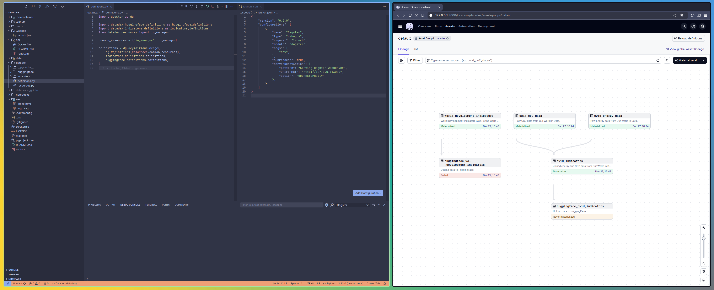
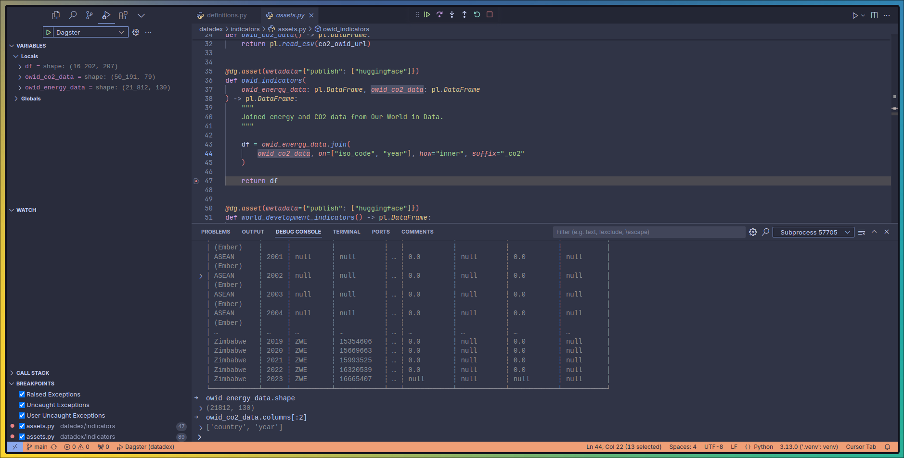

I haven't used a debugger probably since my first year of college working with C++. I've been coding in Notebook heavy environments since I switched to Python. To be honest, I'm not sure how to even debug a Python script without jumping into an IPython shell or Jupyter Notebook. Recently, I've been working a lot with Dagster and it has been tricky to debug. Lots of copy pasting and trying to replicate Dagster state in Notebooks.

So, I've spent some time trying to setup a better experience for Dagster development using the VSCode/Cursor Debugger. I think I've found a solution that works well enough!

## Debugging Dagster

You can debug arbitrary Python code through a `launch.json` file using the [Python extension](https://code.visualstudio.com/docs/python/debugging).
This file can be used to configure the debugger. In our case, we want to run a module, and, as an extra, launch the Dagster UI when it detects the string "Serving dagster-webserver".

```json
{
    "version": "0.2.0",
    "configurations": [
        {
            "name": "Dagster",
            "type": "debugpy",
            "request": "launch",
            "module": "dagster",
            "args": [
                "dev",
            ],
            "subProcess": true,
            "serverReadyAction": {
                "pattern": "Serving dagster-webserver",
                "uriFormat": "http://127.0.0.1:3000",
                "action": "openExternally"
            },
        }
    ]
}
```

Save this file in the root of your Dagster project and hit F5 (in VSCode or Cursor) to start the debugger. The browser will open and you'll be able to see the Dagster UI!



If you open the image in a new tab, you'll see that the debugger is running (orange bar in the bottom). You can now start debugging your Dagster assets or resources! To do that, **add a breakpoint in your code** and then trigger an asset or resource from the Dagster UI. The debugger will pause at the breakpoint and you'll be able to see the state of the world at that point in time.



If you look closely, you'll see that the debugger console is open. This is where you can run arbitrary Python code! This is very useful. I can now treat this console as the "scratchpad" / IPython shell and do small but useful things like inspecting the data returned from an API, checking out a DataFrame transformation, or running a SQL query with a database resource to gather more context.

For me, there is only one downside to this experience, writing code in the debugger console is not the smoothest experience since there is no Copilot. But there is a workaround for that!

You can write code next to your breakpoint and send things to the debugger console with a keybinding that triggers the `editor.debug.action.selectionToRepl` command. This is the keybinding that I've added to my `keybindings.json` file in VSCode / Cursor.

```json
{
  "key": "shift+alt+d",
  "command": "editor.debug.action.selectionToRepl"
}
```

Select the code you want to send to the debugger console and press `shift+alt+d` and the code will be sent and executed in the debugger console!

With these couple of steps, I've found a way to debug Dagster in a way that is both efficient and productive. I'm sure there are better ways to do this, but this is the one that works for someone like me, who has a hard time writing code outside of a Notebook!
