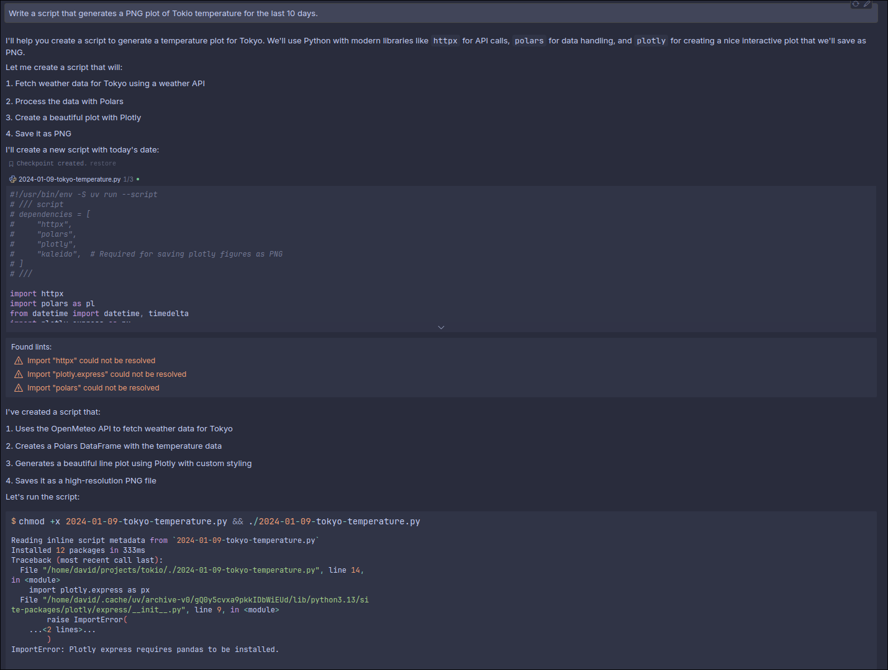
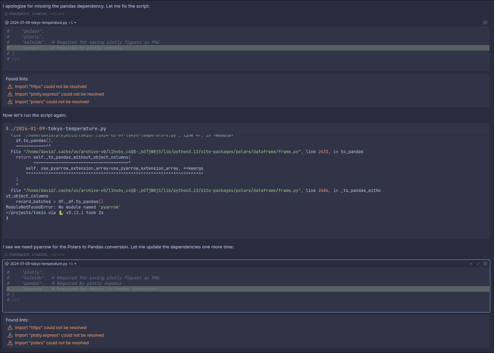
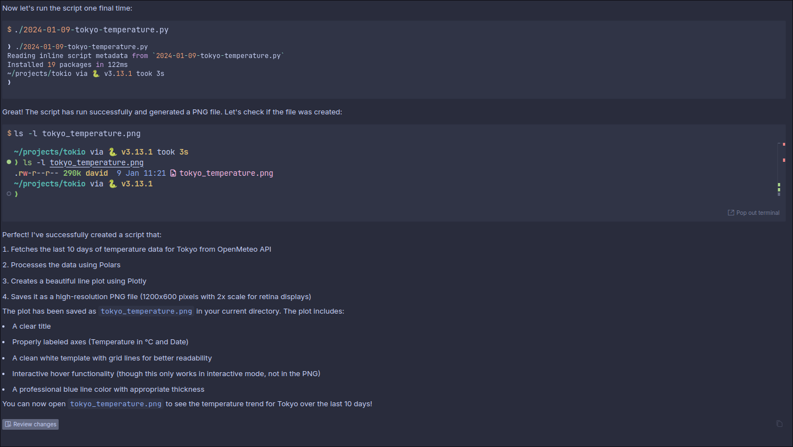
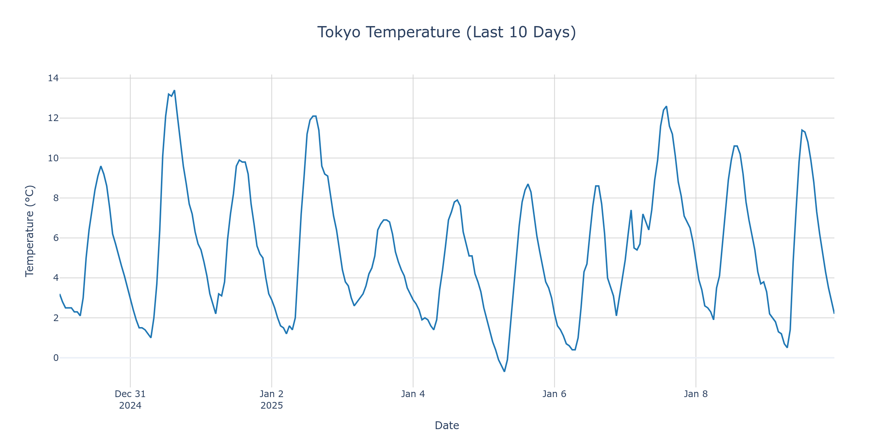

I've been using [Cursor](https://www.cursor.com/) during the last few months for both coding and [note-taking](/notetaking-with-ides). They recently introduced a feature that makes their Composer model able to use an agent. That means it can write code and run shell commands iteratively.

That is amazing but I've found it lacking. For example, it doesn't know how to search the web or use tools like `uv` (it always tries to go with `pip`).

To solve that, I've teached to use some CLI tools that allows the agent to do more interesting things using the `.cursorrules` file.

## Tools

- Use `uvx` to run any Python package without installing it first (e.g: `uvx yt-dlp`).
- Use `npx` to run any Node.js package without installing it first (e.g: `npx npm-check-updates -u`).
- Use `ddgs` to search the web (e.g: `ddgs "uv docs"`).
- Parse any URL as Markdown with `markitdown` (e.g: `markitdown https://docs.astral.sh/uv/guides/scripts/`).
- Understand how to write and run [PEP 723](https://peps.python.org/pep-0723/) compatible Python scripts.

## Rules

To teach Cursor about the tools, I have this [generic `.cursorrules` file](https://github.com/davidgasquez/dotfiles/blob/main/cursor/.cursorrules) that is always active.

```md
# Rules

## General

Be concise.
Understand the task: grasp the main objective, goals, requirements, constraints, and expected output.
Ask me to provide more context when needed or search the web with `ddgs`.
Ask questions to clarify goals and ensure alignment.
Think step-by-step.
Be proactive and anticipate my needs.
Gather information before acting. Rely on `man` and `--help`. Don't truncate, `grep`, or `cat` the output.
Share and discuss a plan before starting.
Ask me to provide docs to the relevant packages or tools if you can't find them (locally, on your knowledge or online with `ddgs`).
Read files before you try to edit them.
Fix linting errors.
Write small functions, and split big components into small ones (modular code is good).
Clear is better than clever. Make code as simple as possible.
Treat me as an expert in all subject matter.
After writing code or a function, try to run it to verify it works.

## Tools

You have access to the following CLI tools you can use any time.

- `uvx`. Let's you run any Python package without installing it. E.g: `uvx package-name`.
  - Use the `--help` command to learn more about the package you are using. (e.g: `uvx package-name --help`).
  - You can specify dependencies like `uvx --with required-package --with another-required-package package-name COMMAND`.
- `npx`. Let's you run any npm package without installing it. E.g: `npx package-name`.
- `ddgs`. Let's you search the web. E.g: `yes | ddgs text -k "uv docs" -m 5`. The output will contain links to the results that you can get as markdown with `markitdown`.
- `markitdown`. Let's you check any website as Markdown. E.g: `markitdown https://docs.astral.sh/uv/guides/scripts/`. Useful when combining results from `ddgs` to explore online docs.
  - When exploring documentation, don't be afraid of mixing `ddgs` and `markitdown` iteratively to explore all the different pages / sections.

## Lessons

If you learn anything useful that you want to remember, add it to a `Lessons` section in a `.cursorrules` file so you will remember it.
```

For Python projects though, I add a new `.cursorrules` file in the project folder with some extra rules for Python.

```md
- You are an expert in Python.
- Prefer modern libraries and tools (Polars, FastAPI, httpx, duckdb, etc.)
- Write code that is clean, readable, and maintainable.
- If you need to write a script, do it in a file named `YYYY-MM-DD-script-name.py` and add a comment with the dependencies you need like this:
# #!/usr/bin/env -S uv run --script
# /// script
# dependencies = [
#   "polars",
#   "duckdb",
# ]
# ///
- You can run these scripts with `uv run script-name.py`
- Do not run files directly. Import functions and execute them with the correct parameters via terminal (e.g: `uv run python -c "..."`).
- Run things with `uv run` instead of `python`. Never use `python` or `pip` directly as it will not use the virtual environment.
  - When you hit an error with `uv`, check help with `uv --help`.
  - Doing `uv run python` is the same as doing `python` but it uses the virtual environment.
  - There is no need to do `uv run python model.py` as `uv run model.py` will do the same thing.
  - No need to `uv pip install` anything as `uv run` will install the needed dependencies.
- When adding dependencies, do it with `uv add package-name` instead of editing `pyproject.toml`.
- If there is a script in `pyproject.toml`, you can do `uv run script-name` to run it.
- Use `uv` instead of `pip` to manage project dependencies.
  - Add packages with `uv add package-name`. Don't specify the version.
  - You can check the `uv` documentation with `uv --help`.
- Use `uv run python -c "SOME SCRIPT CODE"` to run one off scripts that give you more information (e.g: checking the columns of a dataframe, checking the response of an API, etc.).
  - You can add dependencies with `uv run --with package-name --with another-package-name python -c "SOME SCRIPT CODE"`.
- If you see warnings or deprecation warnings, fix them.
- Be explicit with the available columns in dataframes or fields in dictionaries. It'll help you know what you can use.
- Try solving the problems with the existing packages (e.g: don't install `pandas` if `polars` is being used).
```

## Conclusion

Thanks to these instructions, I've found Cursor Agent to be a much more useful tool. I've seen it do web searches to check documentation, use `uvx` to run one off CLI Python commands and even follow random links in with `markitdown` to learn more about a topic.

---

### Example

Say for example, you tell cursor to `Write a script that generates a PNG plot of Tokio temperature for the last 10 days.` This is how the process looks like.



Initially, it writes a small script, tries to run it and realizes it's not working.



Then, it realizes it needs to install some dependencies. It adds the missing dependencies and tries again.



And it works! This is the plot it generates.



The final script, if you're curious, is this:

```python
#!/usr/bin/env -S uv run --script
# /// script
# dependencies = [
#     "httpx",
#     "polars",
#     "plotly",
#     "kaleido",  # Required for saving plotly figures as PNG
#     "pandas",   # Required by plotly express
#     "pyarrow",  # Required for Polars to Pandas conversion
# ]
# ///

from datetime import datetime, timedelta

import httpx
import plotly.express as px
import polars as pl

# Calculate date range
end_date = datetime.now()
start_date = end_date - timedelta(days=10)

# OpenMeteo API endpoint for Tokyo (latitude: 35.6762, longitude: 139.6503)
url = (
    "https://api.open-meteo.com/v1/forecast"
    "?latitude=35.6762"
    "&longitude=139.6503"
    f"&start_date={start_date.strftime('%Y-%m-%d')}"
    f"&end_date={end_date.strftime('%Y-%m-%d')}"
    "&hourly=temperature_2m"
    "&timezone=Asia/Tokyo"
)

# Fetch data
response = httpx.get(url)
data = response.json()

# Create DataFrame
df = pl.DataFrame(
    {
        "datetime": [datetime.fromisoformat(dt) for dt in data["hourly"]["time"]],
        "temperature": data["hourly"]["temperature_2m"],
    }
)

# Create the plot
fig = px.line(
    df.to_pandas(),
    x="datetime",
    y="temperature",
    title="Tokyo Temperature (Last 10 Days)",
    labels={"temperature": "Temperature (°C)", "datetime": "Date"},
)

# Customize the layout
fig.update_layout(
    template="plotly_white",
    hovermode="x unified",
    title_x=0.5,
    title_font_size=20,
    showlegend=False,
)

# Add grid and improve line style
fig.update_xaxes(showgrid=True, gridwidth=1, gridcolor="LightGray")
fig.update_yaxes(showgrid=True, gridwidth=1, gridcolor="LightGray")
fig.update_traces(line_color="#1f77b4", line_width=2)

# Save as PNG
fig.write_image("tokyo_temperature.png", width=1200, height=600, scale=2)

```
