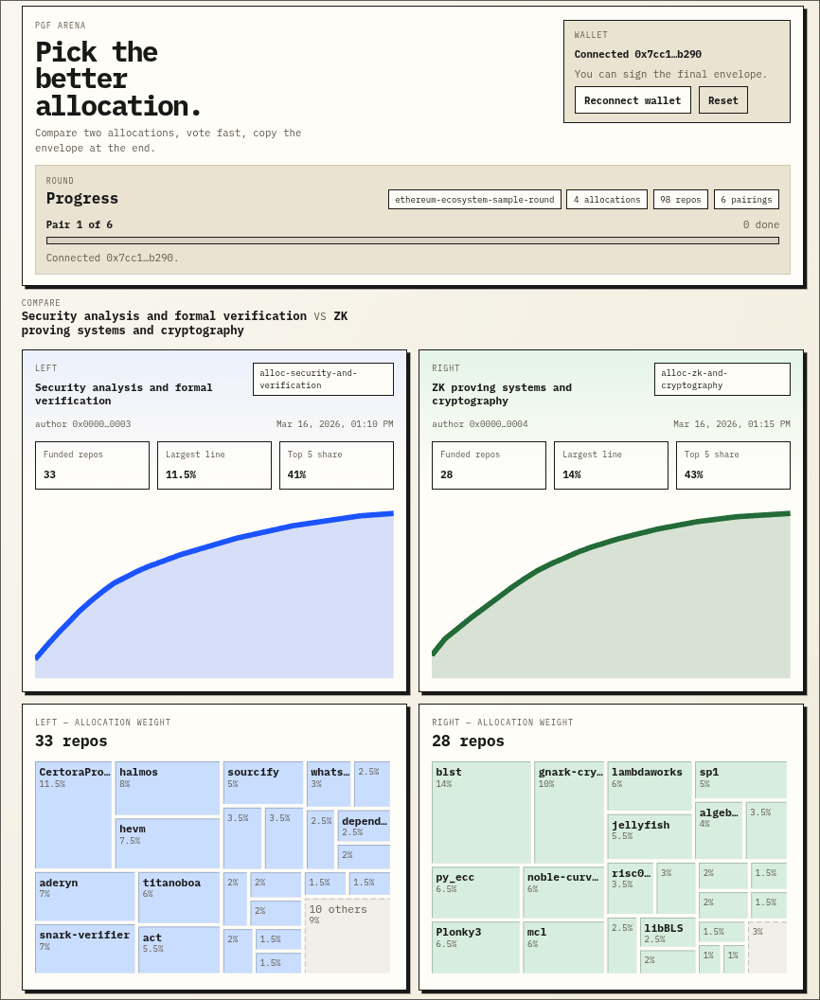

I've been building something to test the idea of a ["Public Goods Funding Arena"](https://f8c34197.pinit.eth.limo/), a tiny app for communities to compare funding allocations with simple pairwise choices.

The core approach I took is boring and simple, but perhaps worth sharing!

- Make the whole app **fully static**.
- Rounds are plain JSON stored somewhere.
- The app loads arbitrary rounds and lets users vote on the best allocation.
- Votes are signed with a wallet, and the output is easy to copy and paste anywhere public.
- Anyone can then derive or verify the rankings/scores for each allocation.

That means the app can live on **IPFS behind an ENS name**, with no app server, no database, and no trusted backend coordinating the process!

This is appealing for the same reason I like [credible neutral AI competitions](/credible-neutral-ai-competitions/): the infrastructure should be easy to inspect, fork, and reproduce. If the interface, round data, and signed outputs are all public, anyone can rerun the process, verify what happened, or host their own version.

A few nice properties fall out of this design:

- **No servers required**: cheaper, simpler, and harder to capture.
- **Reproducible**: public rounds, votes, and aggregation scripts.
- **Portable**: round data can live on IPFS, a VPS, GitHub Gists, At Protocol, or anywhere else.

I think this is a fun way to build simple coordination tools. Fewer moving parts, less trust, more transparency: all good things for a nicer path to credible neutrality!

The first use case I'd like to test with this app is the following experiment: **collect anonymized allocation proposals, let users vote on them, and use the vote data to identify the strongest allocations**. This is something [I wrote about a while ago](/weight-allocation-mechanism-evals/), but it would be fun to explore. Would [Deep Funding](/handbook/deepfunding)'s final weight allocation be preferred over, say, a random allocation produced by an agent running a local LLM?
